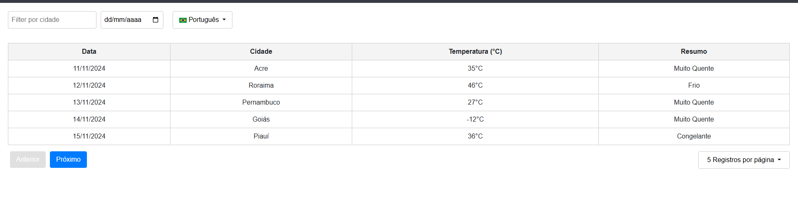

# Weather

## Projeto



## Como utilizar o projeto

### Clonar o repositório

```bash
  git clone git@github.com:andreyna1808/weather.git
```

Ou...

```bash
  git clone https://github.com/andreyna1808/weather.git
```

## Tecnologias utilizadas

[](https://skillicons.dev)

## Email para contato: andreyna.m.carvalho@gmail.com

### TCC by Andreyna Carvalho 🤗

[<br><sub>Andreyna Carvalho</sub>](https://github.com/andreyna1808)
